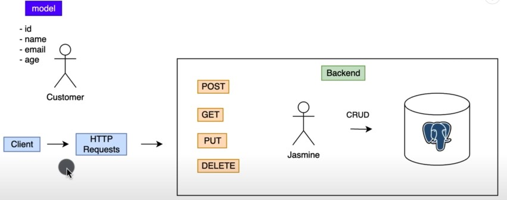
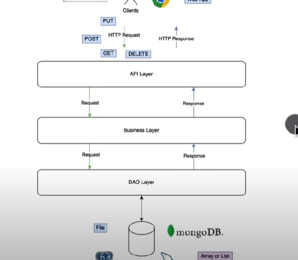
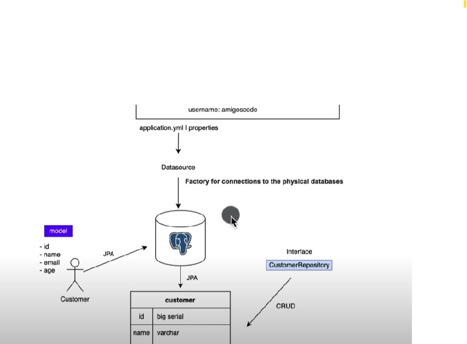

# Spring 3

[Spring docs](https://spring.io/projects/spring-boot)

Spring has modules , like security , loggin ...

## Spring initizlizer

[Spring initzializer](https://start.spring.io/)

to change version of spring we can apply o the pom.xml .

Everything else managed for us.

The pom xml has packages and dependencies of the project , managed by maven in our case.

## Running the app

If tomcat starts works fine , it starts in port 8080.

## Setting up Spring app from 0
What SpringAplication.run(Main.class,args); it runs our Main class and also run everything it gets from the command line "args".

## What is tomcat

Implementation of jakarta servlet , extension and web socket tech.
Provides pure java http wb server , a java web server app.

Listens to port 8080 -> processes request -> response to client.
There are more web servers example : jetty.

We run the app and see :8080

[http://localhost:8080/](http://localhost:8080/)
Thus this label we shall see.

We set a request , we recieve the request but nothing was found "no explicit mapping".
Cant process request.

## More about embedded web server.
[info config embbeded web server](https://docs.spring.io/spring-boot/docs/current/reference/html/howto.html#howto.webserver)

## How spring manages json response

[Jackson](https://github.com/FasterXML/jackson)

----------
important jackson seralization and deserialization

----------

## Spring N-tier architecture

N tier u have layers , each layer is resppnsible for performing 1 and only 1 single thing.

We created our model--> Customer first.

Allows to stote customers 
## Data base

We will configure model with JPA "jakarta persistence" jakarta.persistence to map to database.

We will configure interface extends a class wich will be mapped to the customer entity to allow us use sql queries managed by us by the jakarta apidoc